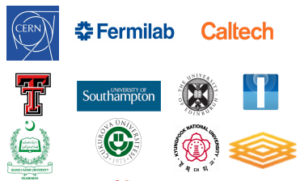
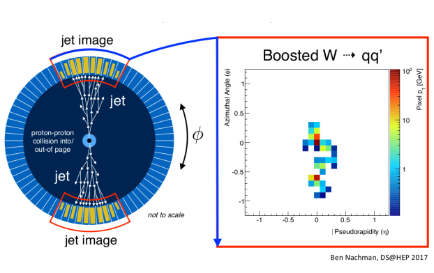
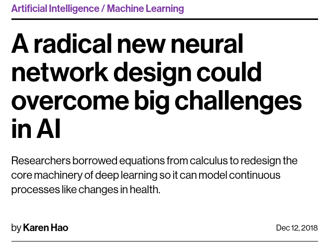

class: center, middle


# High Energy Physics, Machine Learning and Society
### Raphael Cobe
### raphael.cobe@unesp.br
### Advanced Institute for Artificial Intelligence
### June, 2019

---
class: center, middle


# http://advancedinstitute.ai

```{r setup, include=FALSE}
options(htmltools.dir.version = FALSE)
```

---
class: center, middle, inverse
# About me

---
class: top
# Sao Paulo Research and Analysis Center - SPRACE

.pull-left[
* Fundamental Research in High Energy Physics
  + Physics analysis: Beyond SM and Heavy Ion Collisions
  + Data processing and storage
  + Scientific instrumentation
* Innovation
  + R&D on new technologies
    + Partnership with the private sector
* Outreach
  + High school professors training
]
.pull-right[
```{r, out.width = "600px", fig.align="center", echo=FALSE}

```
]

---
class: center, bottom, inverse
background-image: url(images/lhc.png)
background-size: cover 

---
class: center, bottom
background-image: url(images/sprace_resources.png)
background-size: center 

---
class: center, bottom
background-image: url(images/ai2.png)
background-size: center 

???
* Why is it important to study AI?

---
class: center, middle, inverse

# Artificial Intelligence

---
class: middle
#What is AI? 
* Making computers that think?
* The automation of activities we associate with human thinking, like decision making, learning ... ?
* The art of creating machines that perform functions that require intelligence when performed by people ?
* The study of mental faculties through the use of computational models ?
* **Anything in Computing Science that we don't yet know how to do properly ? (!)**

---
class: center, middle

# Machine Learning.

```{r, out.width = "400px", fig.align="center", echo=FALSE}
knitr::include_graphics("images/machine_learning.png")
```


---
class: center, bottom, inverse
background-image: url(images/hal9000.jpg)
background-size: cover 

--
# Meet HAL 9000

---
class: top
## 2001: A Space Odyssey
  * Classic science fiction movie from **1969**;
  * Part of the story centers around an intelligent computer called HAL
.red[HAL] - .red[**H**]euristically programmed .red[**AL**]gorithmic computer  
  * HAL is the “brains” of an intelligent spaceship
  * in the movie, HAL can
    + speak easily with the crew
    + see and understand the emotions of the crew
    + navigate the ship automatically
    + diagnose on-board problems
    + make life-and-death decisions
    + display emotions
    
**In 1969 this was science fiction: is it still science fiction?**

???
* HAL is the imidiate letters after IBM;

---
class: center, inverse

# speak easily with the crew

<iframe width="650" height="415" src="https://www.youtube.com/embed/78-1MlkxyqI?controls=1&amp;start=2" frameborder="0" allow="accelerometer; autoplay; encrypted-media; gyroscope; picture-in-picture" allowfullscreen></iframe>

---
class: center, inverse

# see and understand the emotions of the crew

<iframe width="650" height="415" src="https://www.youtube.com/embed/qJqTjvGGjAs?controls=1&start=78" frameborder="0" allow="accelerometer; autoplay; encrypted-media; gyroscope; picture-in-picture" allowfullscreen></iframe>

---
class: center, inverse

# navigate the ship automatically

<iframe width="650" height="415" src="https://www.youtube.com/embed/IMSozUpFFkU?controls=1" frameborder="0" allow="accelerometer; autoplay; encrypted-media; gyroscope; picture-in-picture" allowfullscreen></iframe>

---
class: center, inverse

# diagnose on-board problems

<iframe width="650" height="415" src="https://www.youtube.com/embed/2VfL6Z7LFE8?controls=1&start=55" frameborder="0" allow="accelerometer; autoplay; encrypted-media; gyroscope; picture-in-picture" allowfullscreen></iframe>

---
class: center, inverse

# make life-and-death decisions

<iframe width="650" height="415" src="https://www.youtube.com/embed/beVWB6NtAaA?controls=1&start=10" frameborder="0" allow="accelerometer; autoplay; encrypted-media; gyroscope; picture-in-picture" allowfullscreen></iframe>

---
class: center, inverse

# display emotions

<iframe width="650" height="415" src="https://www.youtube.com/embed/LoJTjeS7Nys?controls=1&start=10" frameborder="0" allow="accelerometer; autoplay; encrypted-media; gyroscope; picture-in-picture" allowfullscreen></iframe>

---
class: center, middle

# In 1969 this was science fiction: is it still science fiction?

---
class: top
# Can we build hardware as complex as the brain?
## How complicated is our brain?
* a neuron, or nerve cell, is the basic information processing unit
* estimated to be on the order of $10^{12}$ neurons in a human brain
* many more synapses ( $10^{14}$ ) connecting these neurons
* cycle time: $10^{-3}$ seconds (1 millisecond)

---
class: top
# Can we build hardware as complex as the brain?
## How complex can we make computers?
* ~ 730k transistors per CPU 
* supercomputer: millions of CPUs, $10^7$ GB of RAM 
* cycle times: order of $10^{-9}$ seconds

---
class: top
# Can we build hardware as complex as the brain?
## Conclusion
* .red[YES]: we can have computers with as many basic processing elements as our brain;
* far fewer interconnections (wires or synapses) than the brain
* much faster updates than the brain
* **but building hardware is very different from making a computer behave like a brain!**

---
class: middle, center, inverse

# High Energy Physics and Machine Learning

---
class: center, top, inverse
background-image: url(images/qcd.png)
background-size: cover

# After a colision

???
* Why is it important to study AI?

---
class: center, bottom
background-image: url(images/ml_hep1.png)
background-size: center 

???
* Why is it important to study AI?

---
class: left
# Classifying Boosted Jets
### Machine Learning
* Train a classifier that could distinguish 
  * Logistic regression, Multilayer perceptron, and Convolutional Neural Net

```{r, out.width = "500px", fig.align="center", echo=FALSE}

```


???
* Why is it important to study AI?

---
class: center, middle, inverse

# AI and Society

---
class: center, bottom
background-image: url(images/ai_investment.png)
background-size: center 

???
* Why is it important to study AI?

---
class: center, bottom
background-image: url(images/pwc.png)
background-size: center 

???
* Why is it important to study AI?


---
class: center, middle, inverse

# Machine Learning and Math


---
class: center, bottom
background-image: url(images/math_ml.png)
background-size: contain 

???
* Why is it important to study AI?


---
class: left
# Machine Learning and Math

```{r, out.width = "600px", fig.align="center", echo=FALSE}

```


???
* Why is it important to study AI?

---
class: middle
# Machine Learning and Math

## Neural Ordinary Differential Equations from a team of Vector Institute researchers at University of Toronto. The paper parameterized the continuous dynamics of hidden units using an ordinary differential equation (ODE).
### Best Paper on Nips 2018

???
* Why is it important to study AI?

---
class: middle
# Machine Learning and Math

### Mathematicians have the most important tools for developing Machine Learning.

#### Invest in programming Skills!

---
class: center, middle
# Impressive Machine Learning Projects
## Google DeepMind AI learning to "walk"
<iframe width="650" height="415" src="https://www.youtube.com/embed/gn4nRCC9TwQ?controls=1" frameborder="0" allow="accelerometer; autoplay; encrypted-media; gyroscope; picture-in-picture" allowfullscreen></iframe>

---
class: center, middle
# Impressive Machine Learning Projects
## Nvidia AI creating faces

<iframe width="650" height="415" src="https://www.youtube.com/embed/bIVU8UuHPKI?controls=1" frameborder="0" allow="accelerometer; autoplay; encrypted-media; gyroscope; picture-in-picture" allowfullscreen></iframe>


---
class: center, middle
# Impressive Machine Learning Projects
## Nvidia AI creating artificial landscapes

<iframe width="650" height="415" src="https://www.youtube.com/embed/JlTEA0VevSY?controls=1&start=14" frameborder="0" allow="accelerometer; autoplay; encrypted-media; gyroscope; picture-in-picture" allowfullscreen></iframe>

---
class: center, middle

# Thanks!


